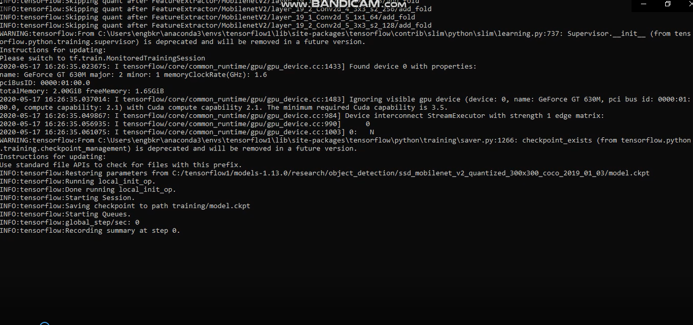

# Windows 10'da TensorFlow (GPU) Kullanarak Birden Çok Nesne İçin Nesne Algılama Sınıflandırıcısını Eğitme

## Özet
*Son Güncelleme 28.06.2020 v.0*


Bu havuz Windows 10 üzerinde kendi eğitim setinizi eğitip yine windows üzerinde koşturulmasını hedeflemektedir.

Eğer mobil bir cihazda nesne tanıma modeli oluşturmak istiyorsak [RASPBERRY PI ILE NESNE ALGILAMA](https://github.com/engbkr/GomSisProje-1-RaspiNesneAlgilama) projemize gözatabilirsiniz.

Tensorflowun 1.13 versiyonu bu api için en optimum çalışan sürümdür.
Aşağıdaki resme tıklayarak eğitimin webcam üzerinden koşturulmasını izleyebilirsiniz.


[](https://youtu.be/mR0XBc8V60E)

Aşağıda kendi derin öğrenme uygulamanızı yapmanız için tüm gereksinimler adım adım anlatılmıştır.

1. [Anaconda,CUDA ve cuDNN kurulumu]
2. [Nesne Algılama dizin yapısını ve Anaconda Sanal Ortamını Kurma]
3. [Resim toplama ve etiketleme]
4. [Eğitim verilerinin oluşturulması]
5. [Etiket haritası oluşturma ve eğitimi yapılandırma]
6. [Eğitim]
7. [Çıkarım grafiğini dışa aktarma]
8. [Yeni eğitilmiş nesne algılama sınıflandırıcısını test etme ve kullanma]


Bu uygulama El, Kalem, Sigara, Saat, Cüzdan, Anahtar, Bant, Kalemlik ve Defter nesneleri için yapılmıştır.Bu nesneleri kendi belirleyeceğiniz nesnelerle değiştirmenin yolları aşağıda adım adım açıklanmıştır.


## Giriş
Bu öğreticinin amacı, sıfırdan başlayarak, birden fazla nesne için kendi evrişimli sinir ağı nesne algılama sınıflandırıcısını nasıl eğiteceğinizi açıklamaktır. Bu öğreticinin sonunda, resimlerdeki, videolardaki veya web kamerası akışındaki belirli nesnelerin etrafındaki kutuları tanımlayabilen ve çizebilen bir programınız olacaktır
TensorFlow-GPU, PC'nizin eğitim sırasında ekstra işlem gücü sağlamak için grafik işlemci kartını kullanmasına izin verir, bu nedenle bu eğitim için kullanılacaktır.
Bu noktada grafik işlemci kartınızın Compute Capability denilen hesaplama gücünün 3,5 ile 7,5 arasında olmasını öneririm.Benim donanımım çok eski ve Compute Capability rankım 2,2 olmasından dolayı eğitimim çok uzun bir süre aldı.(Yaklaşık 10 gün)
 
1. Anaconda, CUDA, ve cuDNN kurulumu
[ Mark Jay'in detaylı Kurulum videosunu](https://www.youtube.com/watch?v=RplXYjxgZbw) izleyip buradaki adımları izleyerek CUDA ve CuDNN'i kuralım.Videoda gösterilen Tensorflow'u şimdilik kurmanıza gerek yok.Sadece eğer Tensorflow 1.13 lullanacaksanız CUDA 10 ve cuDNN 10 u yüklemeniz gerekmektedir.CUDA ve CuDNN kullanacağınız Tensorflow ile uyumlu olmalıdır.
[TensorFlow websitesi](https://www.tensorflow.org/install/gpu) hangi sürüm için hangi CUDA ve CuDNN kullanmanız gerektiğine izin verir.

Daha sonra Anaconda 3'ü videoda belirtildiği gibi kurun.


### 2. TensorFlow Dizini ve Anaconda Sanal Ortamını kurun
TensorFlow Nesne Algılama API'sı, GitHub deposunda sağlanan belirli dizin yapısının kullanılmasını gerektirir. Ayrıca, birkaç ek Python paketi, PATH ve PYTHONPATH değişkenlerine spesifik eklemeler ve bir nesne algılama modelini çalıştırmak veya eğitmek için her şeyi ayarlamak için birkaç ek kurulum komutu gerektirir.
Bu bölüm oldukça titiz olunması gereken bölümdür.Kurulumu yönergeye uygun dikkatlice yapınız.

#### 2a. GitHub'dan TensorFlow Nesne Algılama API'sı deposunu indirin
Doğrudan C: 'de bir klasör oluşturun ve “tensorflow1” olarak adlandırın. Bu çalışma dizini, tam TensorFlow nesne algılama çerçevesinin yanı sıra egzersiz görüntülerinizi, egzersiz verilerinizi, eğitimli sınıflandırıcıyı, yapılandırma dosyalarını ve nesne algılama sınıflandırıcısı için gereken diğer her şeyi içerir
"Clone or Download" düğmesine tıklayarak ve zip dosyasını indirerek https://github.com/tensorflow/models adresinde bulunan tam TensorFlow nesne algılama havuzunu indirin. İndirilen zip dosyasını açın ve “models-master” klasörünü doğrudan yeni oluşturduğunuz C: \ tensorflow1 dizinine çıkarın. “Models-master” ı yalnızca “modeller” olarak yeniden adlandırın.

Not: Verilen link genelde son tensorflow sürümüne göre kullanıcılar tarafından güncellenebiliyor.Ben tensorflow 1.13 için bu linki çalıştırabildim.Eğer bir hata alırsanız aşağıda bulunan versiyonlara karşılık gelen havuzları indirip C diskinde oluşturduğunuz tensorflow1 klasörüne çıkarın.


| TensorFlow version | GitHub Modelleri Veri Havuzu Kuruluşu |
|--------------------|---------------------------------|
|TF v1.7             |https://github.com/tensorflow/models/tree/adfd5a3aca41638aa9fb297c5095f33d64446d8f |
|TF v1.8             |https://github.com/tensorflow/models/tree/abd504235f3c2eed891571d62f0a424e54a2dabc |
|TF v1.9             |https://github.com/tensorflow/models/tree/d530ac540b0103caa194b4824af353f1b073553b |
|TF v1.10            |https://github.com/tensorflow/models/tree/b07b494e3514553633b132178b4c448f994d59df |
|TF v1.11            |https://github.com/tensorflow/models/tree/23b5b4227dfa1b23d7c21f0dfaf0951b16671f43 |
|TF v1.12            |https://github.com/tensorflow/models/tree/r1.12.0 |
|TF v1.13            |https://github.com/tensorflow/models/tree/r1.13.0 |
|Bizim kurduğumuz    |https://github.com/tensorflow/models |


#### 2b. Faster-RCNN-Inception-V2-COCO modelini indirin
TensorFlow, model hayvanat bahçesinde birkaç nesne algılama modeli (belirli sinir ağı mimarileri ile önceden eğitilmiş sınıflandırıcılar) sunmaktadır . Bazı modeller (SSD-MobileNet modeli gibi) daha hızlı algılamaya izin veren ancak daha az doğrulukla bir mimariye sahipken, bazı modeller (Faster-RCNN modeli gibi) daha yavaş algılama ancak daha fazla doğruluk sağlar.


Algılama sınıflandırıcınızı hangi modeli eğiteceğinizi seçebilirsiniz. Nesne detektörünü düşük hesaplama gücüne sahip bir cihazda (akıllı telefon veya Raspberry Pi gibi) kullanmayı planlıyorsanız, SDD-MobileNet modelini kullanın. Dedektörünüzü iyi çalışan bir dizüstü bilgisayarda veya masaüstü bilgisayarda çalıştırıyorsanız, RCNN modellerinden birini kullanın.

Bu eğitimde Faster-RCNN-Inception-V2 modeli kullanılacaktır.[Modeli buradan indirin.](http://download.tensorflow.org/models/object_detection/faster_rcnn_inception_v2_coco_2018_01_28.tar.gz) İndirilen daha faster_rcnn_inception_v2_coco_2018_01_28.tar.gz dosyasını Winrar gibi bir dosya arşivleyicisiyle açın ve fast_rcnn_inception_v2_coco_2018_01_28 klasörünü C: \ tensorflow1 \ models \ research\ object_detection klasörüne çıkarın.

#### 2c. Bu havuzu Githubdan indirin
Bu sayfada bulunan deponun tamamını indirin (en üste kaydırın ve Klonla veya İndir'e tıklayın) ve tüm içeriği doğrudan C: \ tensorflow1 \ models \ Research \ object_detection dizinine çıkarın. (Varolan "README.md" dosyasının üzerine yazabilirsiniz.) Bu, öğreticinin geri kalanı için kullanılacak belirli bir dizin yapısı oluşturur.

Bu noktada, \ object_detection klasörünüzün şöyle görünmesi gerekir:


<p align="center">
  
</p>

Kendi nesne dedektörünüzü eğitmek istiyorsanız, aşağıdaki dosyaları silin (klasörleri silmeyin):
- \ Object_detection \ images \ train  ve   \ object_detection \ images \ test içindeki tüm dosyalar
- \ Object_detection \ images'deki “test_labels.csv” ve “train_labels.csv” dosyaları
- \ Object_detection \ training içindeki tüm dosyalar
- \ Object_detection \ inference_graph içindeki tüm dosyalar

Artık altyapımızı kurduğumuza göre başlayabiliriz.


#### 2d. Anaconda sanal ortamı kurun
Şimdi bir anaconda sanal ortamı kuracağız.Başlat menüsünden anaconda yazıp gelen programı yönetici olarak çalıştırın.Açılan terminalde aşağıdaki komutu verin;


```
C:\> conda create -n tensorflow1 pip python=3.5
```
Ardından, ortamı etkinleştirin ve aşağıdakileri yaparak pip'i güncelleyin:
```
C:\> activate tensorflow1

(tensorflow1) C:\>python -m pip install --upgrade pip
```
Bu ortama tensorflow-gpu'yu şu şekilde kurun:
```
(tensorflow1) C:\> pip install --ignore-installed --upgrade tensorflow-gpu
```

Aşağıdaki komutları vererek diğer gerekli paketleri yükleyin:
```
(tensorflow1) C:\> conda install -c anaconda protobuf
(tensorflow1) C:\> pip install pillow
(tensorflow1) C:\> pip install lxml
(tensorflow1) C:\> pip install Cython
(tensorflow1) C:\> pip install contextlib2
(tensorflow1) C:\> pip install jupyter
(tensorflow1) C:\> pip install matplotlib
(tensorflow1) C:\> pip install pandas
(tensorflow1) C:\> pip install opencv-python
```

#### 2e. PYTHONPATH ortam değişkenini yapılandırma
\models\research, ve \models\research\slim klasörleri için pythonpath oluşturmak için aşağıdaki komutu giriyoruz.
```
(tensorflow1) C:\> set PYTHONPATH=C:\tensorflow1\models;C:\tensorflow1\models\research;C:\tensorflow1\models\research\slim
```

#### 2f. Protobuf'ları derleyin ve setup.py dosyasını çalıştırın
Ardından, model ve eğitim parametrelerini yapılandırmak için TensorFlow tarafından kullanılan Protobuf dosyalarını derleyin. Ne yazık ki, TensorFlow'un Nesne Algılama API'sı yükleme sayfasında yayınlanan kısa protokol derleme komutu Windows'ta çalışmıyor. \ Object_detection \ protos dizinindeki her .proto dosyası komut tarafından tek tek çağrılmalıdır.

Anaconda Komut İstemi'nde, dizinleri \ modeller \ research dizinine değiştirin:
```
(tensorflow1) C:\> cd C:\tensorflow1\models\research
```

Ardından aşağıdaki komutu kopyalayıp komut satırına yapıştırın ve Enter tuşuna basın:
```
protoc --python_out=. .\object_detection\protos\anchor_generator.proto .\object_detection\protos\argmax_matcher.proto .\object_detection\protos\bipartite_matcher.proto .\object_detection\protos\box_coder.proto .\object_detection\protos\box_predictor.proto .\object_detection\protos\eval.proto .\object_detection\protos\faster_rcnn.proto .\object_detection\protos\faster_rcnn_box_coder.proto .\object_detection\protos\grid_anchor_generator.proto .\object_detection\protos\hyperparams.proto .\object_detection\protos\image_resizer.proto .\object_detection\protos\input_reader.proto .\object_detection\protos\losses.proto .\object_detection\protos\matcher.proto .\object_detection\protos\mean_stddev_box_coder.proto .\object_detection\protos\model.proto .\object_detection\protos\optimizer.proto .\object_detection\protos\pipeline.proto .\object_detection\protos\post_processing.proto .\object_detection\protos\preprocessor.proto .\object_detection\protos\region_similarity_calculator.proto .\object_detection\protos\square_box_coder.proto .\object_detection\protos\ssd.proto .\object_detection\protos\ssd_anchor_generator.proto .\object_detection\protos\string_int_label_map.proto .\object_detection\protos\train.proto .\object_detection\protos\keypoint_box_coder.proto .\object_detection\protos\multiscale_anchor_generator.proto .\object_detection\protos\graph_rewriter.proto .\object_detection\protos\calibration.proto .\object_detection\protos\flexible_grid_anchor_generator.proto
```
Bu, \ object_detection \ protos klasöründeki her name.proto dosyasından bir name_pb2.py dosyası oluşturur.


Son olarak, C: \ tensorflow1 \ models \ research dizininden aşağıdaki komutları çalıştırın:
```
(tensorflow1) C:\tensorflow1\models\research> python setup.py build
(tensorflow1) C:\tensorflow1\models\research> python setup.py install
```

#### 2g. Çalıştığını doğrulamak için TensorFlow kurulumunu test edin
TensorFlow Nesne Algılama API'sı artık nesne algılaması için önceden eğitilmiş modelleri kullanmak veya yeni bir tane eğitmek üzere ayarlanmıştır. Jupyter ile object_detection_tutorial.ipynb komut dosyasını başlatarak test edebilir ve kurulumunuzun çalıştığını doğrulayabilirsiniz. \ Object_detection dizininden şu komutu verin:
```
(tensorflow1) C:\tensorflow1\models\research\object_detection> jupyter notebook object_detection_tutorial.ipynb
```
Bu, komut dosyasını varsayılan web tarayıcınızda açar ve kodda birer birer ilerlemenizi sağlar. Üst araç çubuğundaki "Çalıştır" düğmesini tıklayarak her bir bölümde gezinebilirsiniz. Bölüm, bölümün yanındaki “In [*]” metni bir sayı ile doldurulduğunda çalıştırılır (örn. “In [1]”).

(Not: komut dosyasının bir kısmı ssd_mobilenet_v1 modelini (74 MB) GitHub'dan indirir. Bu, bölümün tamamlanmasının biraz zaman alacağı anlamına gelir, bu yüzden sabırlı olun.)
Komut dosyasının sonuna geldiğinizde, sayfanın alt kısmında iki etiketli resim görmelisiniz. Bunu görürseniz, her şey düzgün çalışıyor!

<p align="center">
  
</p>

### 3. Resimleri Toplayın ve Etiketleyin
Artık TensorFlow Nesne Algılama API'sı hazır ve kullanıma hazır olduğundan, yeni bir algılama sınıflandırıcısını eğitmek için kullanacağı görüntüleri sağlamamız gerekiyor.
#### 3a. Resim Toplama
TensorFlow bir nesneyi tanımlayabilmek için onun yüzlerce resmine ihtiyaç duyar.Görüntüler farklı ışık koşullarında farklı nesnelerle beraber, tanımlanacak nesnenin bir bölümü olmadan vs gibi farklı kondisyonlar içermelidir.
Kendi sınıflandırıcım için 10 farklı nesne kullandım.(Kalem, Anahtar, Cüzdan, Kalemlik, Sigara, Saat, Başka Saat, Defter, Klavye,Bant)
Herbir nesneyi eğitmek  için ortalama 200 görüntü gerekmektedir.Buda başlangıç olarak ne kadar az nesne tanımlarsanız eğitim süresini ve toplayacağınız resimlerin külfetine azaltacaktır.
Ben Saat ve Cüzdan için bu kurala uyarken diğerlerinde daha az resim toplamakla yetindim.Buda hem ilgili nesneleri doğru tanımamı hemde training süresini artıracak yönde etkiledi.

<p align="center">
  
</p>

Telefonunuzu, nesnelerin resimlerini çekmek veya Google Görsel Arama'dan nesnelerin resimlerini indirmek için kullanabilirsiniz
Görüntülerin çok büyük olmadığından emin olun. Her biri 200 KB'tan az olmalı ve çözünürlükleri 720x1280'den fazla olmamalıdır. Görüntüler ne kadar büyük olursa, sınıflandırıcıyı eğitmek o kadar uzun sürer. Görüntülerin boyutunu azaltmak için bu depodaki resizer.py komut dosyasını kullanabilirsiniz.
İhtiyacınız olan tüm resimlere sahip olduktan sonra,% 20'sini \ object_detection \ images \ test dizinine ve% 80'ini \ object_detection \ images \ train dizinine taşıyın. \ Test ve \ train dizinlerinde resimlerin farklı ve çeşitli resimler bulunduğundan emin olun.

#### 3b. Resimleri Etiketleme

Toplanan tüm resimlerle, her resimde istenen nesneleri etiketleme zamanı. LabelImg, görüntüleri etiketlemek için harika bir araçtır ve GitHub sayfasında, görüntünün nasıl kurulacağı ve kullanılacağı konusunda çok net talimatlar bulunur.

[LabelImg GitHub linki](https://github.com/tzutalin/labelImg)

[LabelImg download linki](https://www.dropbox.com/s/tq7zfrcwl44vxan/windows_v1.6.0.zip?dl=1)

LabelImg'ı indirip yükleyin, \ images \ train dizininize yönlendirin ve ardından her görüntüdeki her nesnenin etrafına bir kutu çizin. \ İmages \ test dizinindeki tüm görüntüler için işlemi tekrarlayın. Bu  biraz zaman alacaktır!
<p align="center">
  
</p>

LabelImg, her görüntü için etiket verilerini içeren bir .xml dosyası oluşturur. Bu .xml dosyaları, TensorFlow eğiticisinin girişlerinden biri olan TFRecord'ları oluşturmak için kullanılacaktır. Her görüntüyü etiketleyip kaydettikten sonra, \ test ve \ train dizinlerindeki her görüntü için bir .xml dosyası olacaktır.
### 4. Eğitim Verileri Üretin

Öncelikle .xml dosyalarını toplu bir hale getirip .csv formatına dönüştürecek kodu aşağıdaki gibi giriyoruz.
```
(tensorflow1) C:\tensorflow1\models\research\object_detection> python xml_to_csv.py
```
Bu, \ object_detection \ images klasöründe bir train_labels.csv ve test_labels.csv dosyası oluşturur.

Ardından, bir metin düzenleyicisinde generate_tfrecord.py dosyasını açın. 31. satırdan başlayarak etiket eşlemesini, her nesneye bir kimlik numarası atandığı kendi etiket eşlemenizle değiştirin. Aynı sayı ataması, Adım 5b'de labelmap.pbtxt dosyası yapılandırılırken kullanılacaktır.
Örneğin hayvanları tanıyacak bir eğitim verisi oluşturacaksanız ve nesneleriniz Kanarya, Kartal ve Aslan olacaksa kodu aşağıdaki gibi değiştirmelisiniz.
```
# Bu nesneleri kendi nesnelerinizle değiştirebilirsiniz.Burada fazladan satır ekleyip yada nesne sayınız 11 den az ise mevcut satırıda silebilirsiniz.

def class_text_to_int(row_label):
    if row_label == 'SAATIM':
        return 1
    elif row_label == 'EL':
        return 2
    elif row_label == 'BASKA SAAT':
        return 3
    elif row_label == 'ANAHTAR':
        return 4
    elif row_label == 'CUZDAN':
        return 5
    elif row_label == 'KALEM':
        return 6
    elif row_label == 'KLAVYE':
        return 7
    elif row_label == 'DEFTER':
        return 8
    elif row_label == 'KALEMLIK':
        return 9
    elif row_label == 'BANT':
        return 10
    elif row_label == 'SIGARA':
        return 11
    else:
        return 0
```
Bununla değiştir;
```
# TO-DO replace this with label map
def class_text_to_int(row_label):
    if row_label == 'kanarya':
        return 1
    elif row_label == 'kartal':
        return 2
    elif row_label == 'aslan':
        return 3
    else:
        None
```
Ardından, \ object_detection klasöründen şu komutları vererek TFRecord dosyalarını oluşturun
```
python generate_tfrecord.py --csv_input=images\train_labels.csv --image_dir=images\train --output_path=train.record
python generate_tfrecord.py --csv_input=images\test_labels.csv --image_dir=images\test --output_path=test.record
```
Bunlar \ object_detection içinde bir train.record ve test.record dosyası oluşturur. Bunlar yeni nesne algılama sınıflandırıcısını eğitmek için kullanılacaktır..

### 5. Etiket Haritası Oluşturun ve Eğitimi Yapılandırın
Eğitimden önce yapılacak son şey, bir etiket haritası oluşturmak ve eğitim yapılandırma dosyasını düzenlemektir.

#### 5a. Etiket Haritası
Etiket eşlemesi, sınıf adlarının sınıf kimlik numaralarıyla eşlenmesini tanımlayarak eğiticiye her nesnenin ne olduğunu söyler. Yeni bir dosya oluşturmak ve C: \ tensorflow1 \ models \ Research \ object_detection \ training klasörüne labelmap.pbtxt olarak kaydetmek için bir metin düzenleyici kullanın. (Dosya türünün .txt değil .pbtxt olduğundan emin olun!) Metin düzenleyicide etiket haritasını aşağıdaki biçimde kopyalayın veya yazın
```
item {
  id: 1
  name: 'SAATIM'
}

item {
  id: 2
  name: 'EL'
}

item {
  id: 3
  name: 'BASKA SAAT'
}

item {
  id: 4
  name: 'ANAHTAR'
}

item {
  id: 5
  name: 'CUZDAN'
}

item {
  id: 6
  name: 'KALEM'
}

item {
  id: 7
  name: 'KLAVYE'
}

item {
  id: 8
  name: 'DEFTER'
}


item {
  id: 9
  name: 'KALEMLIK'
}

item {
  id: 10
  name: 'BANT'
}

item {
  id: 11
  name: 'SIGARA'
}


```
Bununla değiştir.
```
item {
  id: 1
  name: 'kanarya'
}

item {
  id: 2
  name: 'kartal'
}

item {
  id: 3
  name: 'aslan'
}
```
Burada önemli olan husus Genarete_TfRecord.py ile aynı tanımlamaların yapılmış olmasıdır.

#### 5b. Eğitimi yapılandırıralım
Son olarak, nesne algılama eğitim hattı yapılandırılmalıdır. Eğitim için hangi modeli ve hangi parametrelerin kullanılacağını tanımlar. Bu, antrenman yapmadan önceki son adımdır!
C: \ tensorflow1 \ models \ Research \ object_detection \ samples \ configs dizinine gidin ve fast_rcnn_inception_v2_pets.config dosyasını \ object_detection \ training dizinine kopyalayın. Ardından, dosyayı bir metin düzenleyicisiyle açın. .Config dosyasında, esas olarak sınıfların ve örneklerin sayısını değiştirerek ve eğitim yoluna dosya yollarını ekleyerek birkaç değişiklik yapılır.
Faster_rcnn_inception_v2_pets.config dosyasında aşağıdaki değişiklikleri yapın. Not: Yollar tek eğik çizgi (ters eğik çizgi DEĞİL) ile girilmelidir, aksi takdirde TensorFlow modeli eğitmeye çalışırken bir dosya yolu hatası verir! Ayrıca, yollar tek tırnak işaretleri (') değil, çift tırnak işaretleri (") içinde olmalıdır.

- Satır 9. Sayı_ sınıflarını, sınıflandırıcının algılamasını istediğiniz farklı nesne sayısına değiştirin. Yukarıdaki kanarya, kartal ve aslan algılayıcısı için,  num_classes : 3 .
- Satır 106. fine_tune_checkpoint öğesini şu şekilde değiştirin:
  - fine_tune_checkpoint : "C:/tensorflow1/models/research/object_detection/faster_rcnn_inception_v2_coco_2018_01_28/model.ckpt"

- 123 ve 125. satırlar. Train_input_reader bölümünde, input_path ve label_map_path öğelerini şu şekilde değiştirin:
  - input_path : "C:/tensorflow1/models/research/object_detection/train.record"
  - label_map_path: "C:/tensorflow1/models/research/object_detection/training/labelmap.pbtxt"

- 130. Satır. Num_examples \ \ \ \ dizininde bulunan görüntü sayısını değiştirin.

- 135 ve 137 satırları. Eval_input_reader bölümünde, input_path ve label_map_path parametrelerini şu şekilde değiştirin:
  - input_path : "C:/tensorflow1/models/research/object_detection/test.record"
  - label_map_path: "C:/tensorflow1/models/research/object_detection/training/labelmap.pbtxt"

Değişiklikler yapıldıktan sonra dosyayı kaydedin. Bu kadar! Eğitim işi yapılandırılmış ve kullanıma hazır!

### 6. Eğitimi Çalıştırın
Son olarak  Train.py dosyasını / object_detection / legacy'den / object_detection klasörüne taşıyın ve aşağıdaki adımları izlemeye devam edin
```
python train.py --logtostderr --train_dir=training/ --pipeline_config_path=training/faster_rcnn_inception_v2_pets.config
```
Her şey doğru şekilde ayarlandıysa, TensorFlow eğitimi başlatır.

<p align="center">
  
</p>

Eğitimin her adımı kaybı rapor eder. Antrenman ilerledikçe yükselmeye başlar ve alçalır. Faster-RCNN-Inception-V2 modeli ile ilgili eğitimim için yaklaşık 4.0'da başladı ve hızla 0.8'in altına düştü.Kayıp 0.05'in altına düşene kadar modelin çalışmasına izin verilmelidir.
Eğitim rutin olarak her 10 dakikada bir kontrol noktalarına kaydeder.Herhangi bir elektrik kesintisi yada pcde yapacağınız performans gerektiren bir işlemde Ctrl-C ile eğitime son verip yukradıaki komutları girerek tekrar devam edebilirsiniz.Eğitim sırasında bilgisayarınız en performanslı modda olmasını öneriririm.
Bilgisayarınızın donanımına göre, nesne sayınıza göre eğitim süresi değişebilir.Benim eğitimim donanımımın eski olmasından kaynaklı 10 gün sürdü.Daha az veri seti ve daha iyi bir donanımla daha kısa zamanlarda eğitiminizi tamamlayabilirisiniz.
 
### 7. Inference Graph'ı Dışa Aktarma
Eğitim tamamlandığına göre, son adım donmuş çıkarım grafiğini (.pb dosyası) oluşturmaktır. \ Object_detection klasöründen, “model.ckpt-XXXX” içindeki “XXXX” öğesinin eğitim klasöründeki en yüksek numaralı .ckpt dosyasıyla değiştirilmesi gereken aşağıdaki komutu verin:
```
python export_inference_graph.py --input_type image_tensor --pipeline_config_path training/faster_rcnn_inception_v2_pets.config --trained_checkpoint_prefix training/model.ckpt-XXXX --output_directory inference_graph
```
Bu, \ object_detection \ inference_graph klasöründe frozen_inference_graph.pb dosyası oluşturur. .Pb dosyası nesne algılama sınıflandırıcısını içerir.

### 8. Yeni Eğitilmiş Nesne Algılama Sınıflandırıcıyı Kullanın!
EdjeElectronics webcam ve video ile görüntü tanımak için bir komut dosyası yazdı.
Nesne algılayıcınızı sınamak için, nesnenin veya nesnelerin bir resmini \ object_detection klasörüne taşıyın ve Object_detection_image.py içindeki IMAGE_NAME değişkenini resmin dosya adıyla eşleşecek şekilde değiştirin. Alternatif olarak, nesnelerin bir videosunu (Object_detection_video.py kullanarak) kullanabilir veya sadece bir USB web kamerası takıp nesnelere (Object_detection_webcam.py kullanarak) yönlendirebilirsiniz.
Komut dosyalarından herhangi birini çalıştırmak için, Anaconda Komut İstemi'ne ““ tensorflow1 ”sanal ortamı etkinken)“ idle ”yazın ve ENTER tuşuna basın. Bu IDLE'yi açar ve oradan komut dosyalarından herhangi birini açabilir ve çalıştırabilirsiniz.(object_detection_image.py, object_detection_video.py yada object_detection_webcam.py)
Her şey düzgün çalışıyorsa, nesne dedektörü yaklaşık 10 saniye boyunca başlatılır ve ardından görüntüde algılanan nesneleri gösteren bir pencere görüntülenir!
<p align="center">
  
</p>

